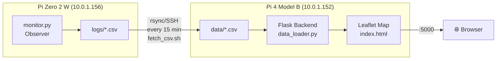

# MeshCore-duty-cycle-dashboard

Web-based dashboard for visualizing [MeshCore](https://meshcore.io/) LoRa mesh network activity on an interactive map. Built with Flask and Leaflet.js, running on a Raspberry Pi 4B.

---

## ✨ Features

- **Interactive Map** – Node positions on an OpenStreetMap-based Leaflet map
- **Route Visualization** – Blue lines between communicating nodes (intensity = line thickness)
- **Time Filter** – View activity for the last 4h, 8h, 12h, or 24h
- **Packet Type Filter** – Filter by ADVERT, RESPONSE, TXT_MSG, REQ, ANON_REQ, ACK, TRACE.
- **Auto-Refresh Data** – CSV files synced from Observer every 15 minutes via rsync
- **Node Details** – Tooltips with node name, hash, packet count, and signal strength
- **GPS Extraction** – Positions from ADVERT packets with lat/lon coordinates
- **Hash Collision Awareness** – Only resolved (unique) nodes shown on the map

---
## 🏗️ Architecture

### Data Flow:

1. **Observer** (Pi Zero) captures LoRa packets via MQTT and writes daily CSV files
2. **fetch_csv.sh** (cron, every 15 min) syncs new CSVs from Pi Zero → Pi 4B
3. **Flask backend** reads CSVs, processes node positions, activity, and routes
4. **Leaflet frontend** displays everything on an interactive map

---

## 📋 Prerequisites

### Hardware
- Raspberry Pi 4 Model B (or similar)
- Network connection to the Observer Pi

### Software
- Raspberry Pi OS (Bookworm/Trixie)
- Python 3.11+
- SSH key access to Observer Pi (for automatic CSV sync)

---

## 🚀 Installation

### 1. Clone the repository

    cd ~/Projects
    git clone https://github.com/Paul-3400/meshcore-duty-cycle-dashboard.git
    cd meshcore-duty-cycle-dashboard

### 2. Create virtual environment

    python3 -m venv venv
    source venv/bin/activate

### 3. Install dependencies

    pip install -r requirements.txt

### 4. Create data directory

    mkdir -p data

### 5. Configure CSV sync (optional but recommended)

Set up passwordless SSH to the Observer Pi:

    ssh-keygen -t ed25519 -f ~/.ssh/id_ed25519 -N ""
    ssh-copy-id paul-rppi@10.0.1.156

Test the sync:

    ./fetch_csv.sh

Set up automatic sync every 15 minutes:

    crontab -e
    # Add this line:
    */15 * * * * /home/paul-rppi/Projects/meshcore-duty-cycle-dashboard/fetch_csv.sh >> /home/paul-rppi/Projects/meshcore-duty-cycle-dashboard/fetch_csv.log 2>&1

### 6. Start the dashboard

    python3 -m app.main

Open in browser: `http://:5000`

## 📁 Project Structure

    meshcore-duty-cycle-dashboard/
    ├── app/
    │   ├── __init__.py
    │   ├── config.py            # Central configuration
    │   ├── data_loader.py       # CSV reading, node positions, routes
    │   └── main.py              # Flask app, API endpoints
    ├── templates/
    │   └── index.html           # Main page (Leaflet map + controls)
    ├── static/
    │   ├── css/style.css        # Dashboard styling
    │   └── js/map.js            # Map initialization
    ├── scripts/
    │   ├── fetch_csv.sh         # CSV sync script (alternative)
    │   └── test_gps_fix.py      # GPS coordinate test
    ├── docs/
    │   └── session-log-*.md     # Development session logs
    ├── data/                    # CSV files from Observer (not in git)
    ├── fetch_csv.sh             # CSV sync (rsync from Pi Zero)
    ├── requirements.txt         # Python dependencies
    ├── LICENSE                  # MIT License
    ├── USAGE.md                 # Usage guide
    └── README.md                # This file

## 🔌 API Endpoints

| Endpoint | Method | Parameters | Description |
|----------|--------|------------|-------------|
| `/` | GET | – | Dashboard (HTML page with map) |
| `/api/positions` | GET | – | All known node positions (from ADVERTs) |
| `/api/activity` | GET | `hours`, `type` | Node activity with packet counts |
| `/api/routes` | GET | `hours`, `type` | Routes between nodes with intensity |

**Default values:** `hours=24`, `type=ALL`

### Example API calls:

    # All node positions
    curl http://localhost:5000/api/positions

    # Activity in the last 8 hours, only RESPONSE packets
    curl "http://localhost:5000/api/activity?hours=8&type=RESPONSE"

    # Routes in the last 24 hours
    curl "http://localhost:5000/api/routes?hours=24"

## ⚙️ Configuration

All settings are in `app/config.py`:

| Setting | Default | Description |
|---------|---------|-------------|
| DATA_DIR | `data/` | Directory for CSV files |
| CSV_SEPARATOR | `;` | CSV delimiter |
| FLASK_HOST | `0.0.0.0` | Listen on all interfaces |
| FLASK_PORT | `5000` | HTTP port |
| FLASK_DEBUG | `True` | Debug mode (set to False in production!) |
| MAP_CENTER_LAT | `46.8` | Map center latitude (Switzerland) |
| MAP_CENTER_LON | `8.2` | Map center longitude |
| MAP_ZOOM | `8` | Initial zoom level |

## 📊 CSV Format

The dashboard reads CSV files produced by the [MeshCore Duty Cycle Observer](https://github.com/Paul-3400/meshcore-duty-cycle-observer).

- **Filename pattern:** `duty_cycle_YYYY-MM-DD.csv`
- **Separator:** `;` (semicolon)
- **Encoding:** UTF-8

**Key columns used by the dashboard:**

| Column | Name | Used for |
|--------|------|----------|
| C | timestamp | Time filtering |
| D | packet_type | Type filtering |
| L | source_hash | Route source |
| M | source_name | Display name |
| N | source_collision | Uniqueness check |
| O | dest_hash | Route destination |
| P | dest_name | Display name |
| Q | dest_collision | Uniqueness check |
| T | lat | Map position |
| U | lon | Map position |

Full column reference: see Observer's [CSV_COLUMNS.txt](https://github.com/Paul-3400/meshcore-duty-cycle-observer/blob/main/CSV_COLUMNS.txt)

## 🔗 Related Projects

| Project | Description |
|---------|-------------|
| [meshcore-duty-cycle-observer](https://github.com/Paul-3400/meshcore-duty-cycle-observer) | Passive LoRa packet monitor – data source for this dashboard |
| [MeshCore](https://meshcore.io/) | The mesh networking firmware |
| [MeshCore Docs](https://docs.meshcore.io/) | Official documentation |
| [MeshCore Flasher](https://flasher.meshcore.io/) | Firmware flashing tool |

---

## 👤 Author

**Paul** – [GitHub: Paul-3400](https://github.com/Paul-3400)

Part of Paul's ElektroTech-Lab 🏠 – Brain Gym Edition 🧠💪

---

## 📄 License

This project is licensed under the MIT License – see [LICENSE](LICENSE) for details.

